# CRM Flow — System Map

## Mermaid Diagram

```mermaid
flowchart LR
    subgraph SOURCES["Sources"]
        S1[LinkedIn Search]
        S2[Crunchbase]
        S3[Job Sites]
        S4[Accelerators]
        S5[News/Funding]
        S6[Referrals]
    end

    subgraph RAW["Raw Intake"]
        R1[leads_companies_raw.csv]
        R2[leads_people_raw.csv]
        R3[hypothesis folders]
    end

    subgraph CRM["Master CRM"]
        subgraph TABLES["Tables"]
            C1[crm_companies_master.csv]
            C2[crm_people_master.csv]
            C3[crm_outreach_activities.csv]
        end
        subgraph STATUS["Dual Status"]
            ST1["status: new→researched→contacted→meeting→won/lost"]
            ST2["priority: hot / medium / low"]
        end
    end

    subgraph EXEC["Execution"]
        E1[Research]
        E2[Outreach]
        E3[Follow-up]
    end

    subgraph CHANNELS["Channels"]
        CH1[LinkedIn DM]
        CH2[Email]
        CH3[Twitter]
        CH4[Intros]
    end

    subgraph LEARN["Learning Loop"]
        L1[Log activity with hooks]
        L2[update_salience.py]
        L3[learnings.csv]
        L4[Research Priority]
    end

    subgraph PROMPTS["Prompts"]
        P1[OUTREACH_PROMPT.md]
        P2[Hook templates]
    end

    %% Flow
    SOURCES --> RAW
    RAW -->|dedupe & validate| CRM
    CRM --> EXEC
    EXEC --> CHANNELS
    CHANNELS -->|last_contact dates| CRM
    EXEC -->|log| LEARN
    LEARN -->|strategy| EXEC
    PROMPTS --> EXEC
```



---

## Detailed Flow

### 1. LEAD INTAKE

```
Source (LinkedIn/Accelerator/Funding news)
    ↓
leads_*_raw.csv (staging)
    ↓
Validate & Dedupe
    ↓
crm_companies_master.csv (website as PK)
crm_people_master.csv (linkedin_url as PK)
```

### 2. RESEARCH PHASE

```
Pick lead from CRM (priority=hot, status=new)
    ↓
Determine audience_segment (yc_founder, enterprise...)
    ↓
Check hooks BY PRIORITY (from learnings.csv):
    1. funding signal?
    2. mutual connection?
    3. recent post?
    4. pain point hypothesis
    ↓
Record: hooks_checked, hooks_available, hook_used
    ↓
Update status: new → researched
```

### 3. OUTREACH PHASE

```
Draft message using OUTREACH_PROMPT.md
    ↓
Send via channel (LinkedIn / Email / Twitter)
    ↓
Log to crm_outreach_activities.csv:
    - audience_segment
    - hook_type
    - channel
    - message_preview
    ↓
Update person status: researched → contacted
```

### 4. RESPONSE TRACKING

```
Check channels for responses
    ↓
Update response_quality:
    - none / negative / neutral / positive / meeting
    ↓
Update person status if response:
    - contacted → responded / meeting
```

### 5. LEARNING LOOP

```
Weekly: python3 update_salience.py --recalc
    ↓
Aggregates by hook_type + audience_segment
    ↓
Calculates salience (0.0 - 1.0)
    ↓
Outputs research priority:
    yc_founder: funding → mutual → job_signal
    enterprise: pain_point → job_signal → funding
    ↓
Next research uses updated priorities
```

---

## File Map

```
sales/
├── leads/
│   ├── leads_companies_raw.csv      ← Raw intake
│   ├── leads_people_raw.csv
│   └── [hypothesis]/                ← Experiment data
│       └── *.csv
│
├── crm/
│   ├── crm_companies_master.csv     ← Master company data
│   ├── crm_people_master.csv        ← Master people data
│   ├── crm_outreach_activities.csv  ← Activity log + hooks
│   └── crm_sources.csv              ← Source tracking
│
├── learnings/
│   ├── learnings.csv                ← Salience scores
│   ├── update_salience.py           ← Weekly recalc
│   └── README.md
│
└── outreach/
    └── OUTREACH_PROMPT.md           ← Message strategy
```

---

## Status Flow

### Lead Funnel (status)
```
new → researched → contacted → responded → meeting → won
                                                   ↘ lost
```

### Priority Levels
```
hot    = Contact immediately
medium = Contact this week
low    = Contact when time permits
```

---

## Key Metrics to Track

| Metric | How to Calculate |
|--------|------------------|
| Leads in pipeline | Count where status != won/lost |
| Hot leads | Count where priority = hot |
| Response rate | (responded + meeting) / contacted |
| Conversion rate | won / total contacted |
| Avg time to response | Days from contacted to responded |

---

## Integration Points

| Channel | Integration | What it provides |
|---------|-------------|------------------|
| **LinkedIn** | Manual / Browser | DM, connection requests |
| **Email** | Gmail API | Send/receive tracking |
| **Twitter** | Manual | DM outreach |
| **Intros** | Manual | Track via mutual connections |
